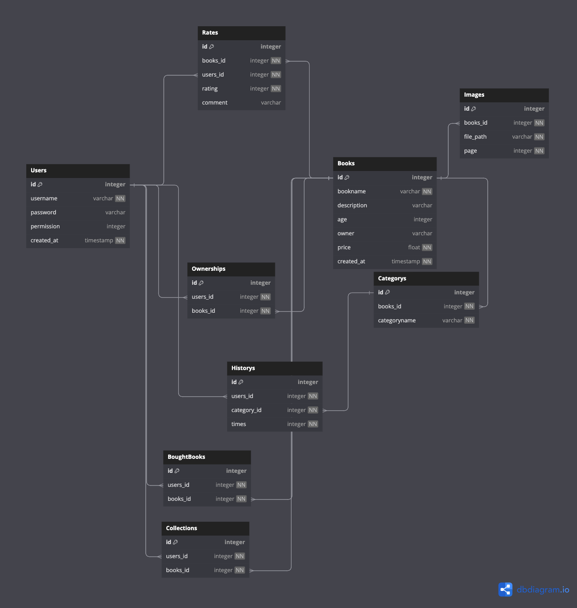

# Backend

## Framework
* express
    * Web server Framework 
* glob
    * Match files using the patterns the shell uses.
    * Better File Structure of Project
* prisma
    * ORM for database
* bcrypt
    * Password hashing for user
* axios
    * API handler
* redis
    * Caching
* swagger-jsdoc
    * API documentation generator
    * https://www.npmjs.com/package/swagger-jsdoc

## Deployment
* kubernetes
    * automating deployment, scaling, and management of containerized applications
* Nginx
    * Load Balancer

## System Architecture

### Basic Architecture

### Advanced Architecture (future work)

## Database relation
https://dbdiagram.io/d/654ba0a67d8bbd6465c4d66c

TBD (will changes to eliminate array)

## Class/Module Functionality

### Users
1. Register
2. Login
3. getCurrentSessions (Return Users with sessionId)

### Books
TODO

### Rates
1. GetBookRatingById
2. GetUsersRatingById
3. GetRatingById

## API Spec
TODO with swagger